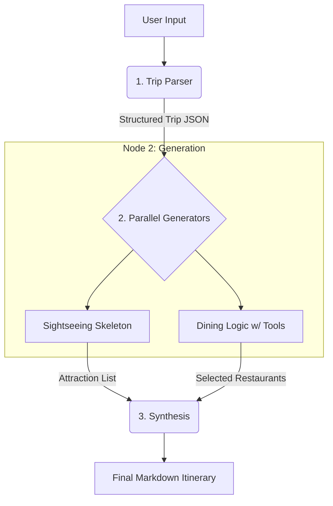

# 🌍 TravelWAI - AI Travel Agent Documentation

## 1. Project Overview
**TravelWAI** is an advanced, production-grade AI travel planning application designed to generate personalized, comprehensive travel itineraries. Unlike traditional chatbots, it employs a **tiered, efficiency-optimized LLM workflow** that separates structured reasoning, real-time data retrieval, and narrative composition into specialized layers.

The system is built using **LangGraph** for orchestration, **Groq** for high-speed LLM inference, and **SerpAPI** for real-time travel data (Google Flights, Hotels, Maps).

---

## 2. System Architecture

TravelWAI uses a **Tiered Logic Architecture** to optimize cost, latency, and quality:
*   **Cost Efficiency**: Smaller models (`llama-3.1-8b-instant`) handle 80% of tasks (parsing, filtering, structuring).
*   **Speed**: Sightseeing and dining logic run in parallel to reduce overall latency.
*   **Quality**: A larger model (`llama-3.3-70b-versatile`) is reserved exclusively for the final narrative synthesis.

---

## 3. Workflow Breakdown (`app/graph.py`)

The application orchestrates its logic via LangGraph in a linear, 3-step pipeline.



### 1. Trip Parser (Data Extraction)
*   **Input**: Natural language user request.
*   **Process**: Extracts trip parameters (origin, destination, dates, budget, interests) into a strict JSON schema using a small LLM.

### 2. Generators (Parallel Processing)
Executes two tasks concurrently using a small LLM:
*   **Sightseeing Skeleton**: Generates a day-by-day JSON list of attractions grouped by proximity.
*   **Dining Logic**: Uses the `search_places` tool (via SerpAPI) to fetch and filter real-world restaurants matching the user's budget and dietary preferences.

### 3. Synthesis (Final Composition)
*   **Input**: Structured outputs from the Parser, Sightseeing, and Dining modules.
*   **Process**: A large LLM weaves the structured data into a cohesive, professional narrative in Markdown format. It strictly follows the provided skeletons avoiding hallucination.

---

## 4. Tools & Integrations

### 1. External Tools (`app/tools/`)
*   **`search_places`**: Uses Google Maps API (via SerpAPI) to find attractions, restaurants, and local transport options.
*   **`get_flights`**: Uses Google Flights API to find flight options.
*   **`get_hotels`**: Uses Google Hotels API to find accommodation with prices and ratings.
*   **`indoor_places_tool`**: Specialized search for museums/malls (useful for weather fallbacks).

### 2. Infrastructure
*   **Streamlit (`main.py`)**: The frontend UI. It manages the session state, user inputs (dates, budget sliders), and displays the final itinerary.
*   **FastAPI (`server.py`)**: A backend service that acts as a bridge to MongoDB. It handles data persistence securely.
*   **MongoDB**: Stores the generated plans and user feedback/evaluations for future fine-tuning.
*   **LangSmith**: integrated for tracing and debugging LLM calls.

---

## 5. Configuration & Environment

The systems relies on a centralized config (`app/config.py`) that manages:
*   **LLM Selection**: Easily switch between `llama-3-8b` and `llama-3-70b`.
*   **API Keys**: Management of Groq, SerpAPI, and Mongo credentials.

---

## 6. API Endpoints (`server.py`)

The backend exposes a REST API built with **FastAPI** to handle data persistence securely.

### POST `/v1/save-plan`
Saves a generated travel plan and its evaluation score to the MongoDB database.

*   **URL**: `http://localhost:8000/v1/save-plan`
*   **Method**: `POST`
*   **Auth**: Required header `x-api-key` (must match `INTERNAL_API_KEY` in `.env`).

**Request Body (JSON):**
```json
{
  "user_prompt": "Plan a 3-day trip to Paris...",
  "agent_response": "Day 1: Arrival...",
  "evaluation_score": 8
}
```

**Response (JSON):**
```json
{
  "status": "success",
  "id": "65c3f..."
}
```

---

## 7. How to Run

### Prerequisites
*   Python 3.10+
*   API Keys: Groq, SerpAPI, MongoDB Connection String.

### Installation
1.  Clone the repository.
2.  Install dependencies:
    ```bash
    pip install -r requirements.txt
    ```
3.  Set up `.env` file with your API keys.

### Execution
1.  **Start the Backend Server** (for saving plans):
    ```bash
    python server.py
    ```
2.  **Start the Frontend App**:
    ```bash
    streamlit run main.py
    ```

### Docker Execution
Alternatively, you can run the entire application stack (Frontend + Backend) using Docker Compose. Ensure you have Docker installed and your `.env` file set up with the necessary API keys.

1.  **Build and run the containers**:
    ```bash
    docker-compose up --build
    ```
This will automatically expose the FastAPI backend on `http://localhost:8000` and the Streamlit frontend on `http://localhost:8501`.
